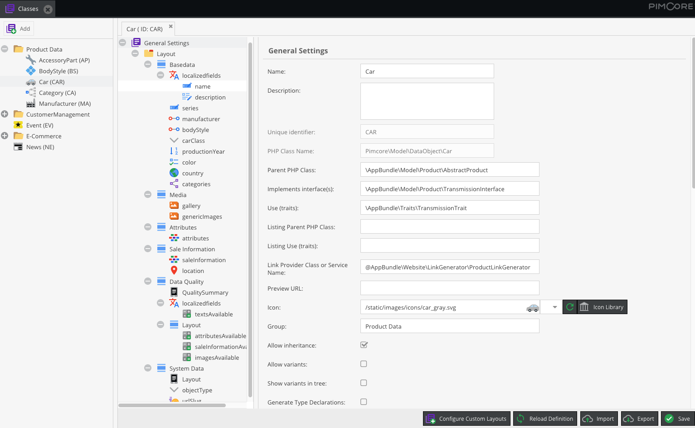

# Using Interfaces and Traits
In some cases it could be helpful to let the generated PHP class for data objects implement interfaces or add some additional functions using traits.

##### Example
This example uses the demo project to show the usage of this features.
We're extending the `Cars` class with methods to retrieve the transmission type as well as the amount of gears. This will be done by implementing an interface and a trait that adds the required methods.

##### Create the interface
```php
<?php
// src/Model/Product/TransmissionInterface.php

namespace App\Model\Product;

interface TransmissionInterface
{
    public function getGearboxType(): ?string;

    public function getNumberOfGears(): ?int;
}
```

##### Create the trait
Returns a GearboxType and a number of gears.
```php
<?php
// src/Traits/TransmissionTrait.php

namespace App\Traits;

trait TransmissionTrait
{
    public function getGearboxType(): ?string
    {
        return "manual";
    }

    public function getNumberOfGears(): ?int
    {
        return 5;
    }
}

```

## Use it with Cars product data
Navigate to the Settings *Settings* -> *Data Objects* -> *Classes* -> *Product Data* -> *Car*

Click on *General Settings* and paste your interface and trait path into `Implements interface(s)` and `Use (traits)`



Save your changes

It will generate the `implements \App\Model\Product\TransmissionInterface` and the
`use \App\Traits\TransmissionTrait;` lines within the DataObject Class.

```php
// var/classes/DataObject/Car.php
...
class Car extends \App\Model\Product\AbstractProduct implements \App\Model\Product\TransmissionInterface {

use \App\Traits\TransmissionTrait;

protected $classId = "CAR";
protected $className = "Car";
...
```
