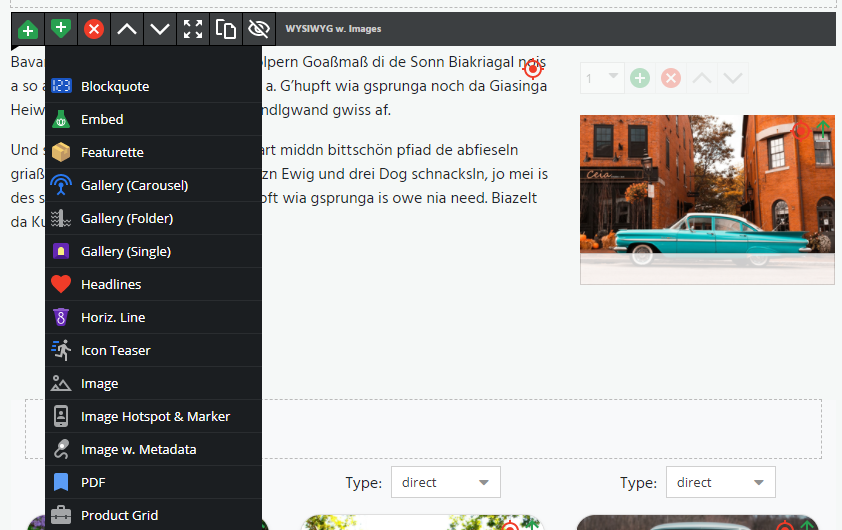

# Areablock Editable

## General 

The areablock is the content construction kit for documents offered by Pimcore.




## Integrate an Areablock in a Template
Similar to the other document editables, an areablock can be integrated in any document view template as follows:

```php
<?= $this->areablock('myAreablock'); ?>
```

Advanced usage with allowed areas, below:

```php
<?= $this->areablock("myAreablock", [
    "allowed" => ["iframe","googletagcloud","spacer","rssreader"],
    "group" => [
        "First Group" => ["iframe", "spacer"],
        "Second Group" => ["rssreader"]
    ],
    "areablock_toolbar" => [
        "title" => "",
        "width" => 230,
        "x" => 20,
        "y" => 50,
        "xAlign" => "right",
        "buttonWidth" => 218,
        "buttonMaxCharacters" => 35
    ],
    "params" => [
        "iframe" => [ // some additional parameters / configuration for the brick type "iframe"
            "parameter1" => "value1",
            "parameter2" => "value2"
        ],
        "googletagcloud" => [ // additional parameter for the brick type "googletagcloud"
            "param1" => "value1"
        ]
    ]]);
?>
```

##### Accessing Parameters from the Brick File
```php
//use the value of parameter named "param1" for this brick
echo $this->param1;
```

##### Sorting Items in the Toolbar
```php
echo  $this->areablock("content", [
    'allowed' => ['image', 'video', 'wysiwyg'],
    'sorting' => ['wysiwyg', 'image', 'video']
]); 
```

And you can see the effect, below:


## Configuration

| Name                | Type   | Description                                                                                                                                                                                  |
|---------------------|--------|----------------------------------------------------------------------------------------------------------------------------------------------------------------------------------------------|
| `allowed`           | array  | An array of area-ID's which are allowed for this tag. The order of items in the array is also used as the default sorting, but of course you can combine this configuration with **sorting** |
| `sorting`           | array  | An array of area-ID's in the order you want to display them in the toolbar.                                                                                                                  |
| `params`            | array  | Optional parameter, this can also contain additional brick-specific configurations, see **brick-specific configuration**                                                                     |
| `group`             | array  | Array with group configuration (see example above).                                                                                                                                          |
| `manual`            | bool   | Forces the manual mode, which enables a complete free implementation for areablocks, for example using real `<table>` elements... example see below                                          |
| `reload`            | bool   | Set to `true`, to force a reload in editmode after reordering items (default: `false`)                                                                                                       |
| `toolbar`           | bool   | Set to `false` to not display the extra toolbar for areablocks (default: `true`)                                                                                                             |
| `dontCheckEnabled`  | bool   | Set to `true` to display all installed area bricks, regardless if they are enabled in the extension manager                                                                                  |
| `limit`             | int    | Limit the amount of elements                                                                                                                                                                 |
| `areablock_toolbar` | array  | Array with option that allows you to change the position of the toolbar.                                                                                                                     |
| `class`             | string | A CSS class that is added to the surrounding container of this element in editmode                                                                                                           |

## Brick-specific Configuration
Brick-specific configurations are passed using the params configuration (see above). 

| Name              | Type | Description                                                                                                                                                     |
|-------------------|------|-----------------------------------------------------------------------------------------------------------------------------------------------------------------|
| `forceEditInView` | bool | If a brick contains an edit.php there's no editmode for the `view.php` file, if you want to have the editmode enabled in both templates, enable this option |
| `editWidth`       | int  | Width of editing popup (if dedicated `edit.php` is used).                                                                                               |
| `editHeight`      | int  | Height of editing popup (if dedicated `edit.php` is used).                                                                                              |
  
##### Example

```php
<?= $this->areablock("myArea", [
    "params" => [
        "my_brick" => [
            "forceEditInView" => true,
            "editWidth" => "800",
            "editHeight" => "500"
        ]
    ]
]); ?>
```
## Methods

| Name                | Return    | Description                                                                            |
|---------------------|-----------|----------------------------------------------------------------------------------------|
| `getCount()`        | int       | Total count of blocks                                                                  |
| `getCurrent()`      | int       | Current number of block (useful with area bricks)                                      |
| `getCurrentIndex()` | int       | Get the current index (index is different from position, as you can move block around) |
| `getElement()`      | array     | Get an element out of an areabrick                                                     |
| `renderIndex()`     | -         | Renders only one specific block within the areablock                                   |

## How to Create Bricks for the Areablock

You can read about **bricks** in the [Bricks](./02_Bricks.md) section.

## Using Manual Mode

The manual mode offers you the possibility to use areablocks with custom HTML, this is for example useful when using tables: 

```php
<?php $areaBlock = $this->areablock("myArea", ["manual" => true])->start(); ?>
<table>
    <?php while ($areaBlock->loop()) { ?>
        <?php $areaBlock->blockConstruct(); ?>
            <tr>
                <td>
                    <?php $areaBlock->blockStart(); ?>
                    <?php $areaBlock->content(); ?>
                    <?php $areaBlock->blockEnd(); ?>
                </td>
            </tr>
        <?php $areaBlock->blockDestruct(); ?>
    <?php } ?>
</table>
<?php $areaBlock->end(); ?>
```

### Accessing Data Within an Areablock Element

See [Block](../06_Block.md) for an example how to get elements from block and areablock editables.
