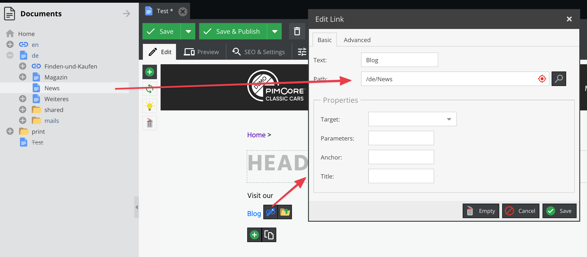
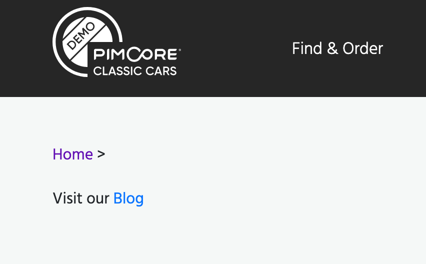
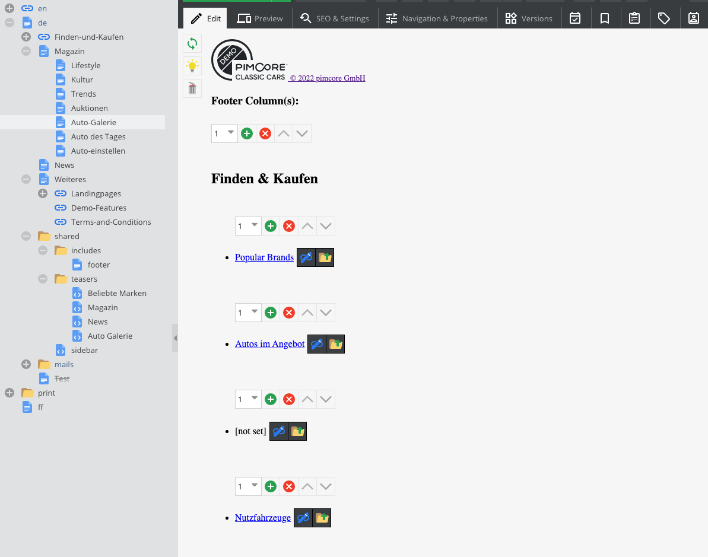

# Link Editable

## General 

The link editable is used for dynamic link creation in documents.

## Configuration

You can pass every valid attribute an `<a>`-tag can have ([w3.org - Link](http://www.w3.org/TR/html401/struct/links.html#h-12.2)), 
such as: `class`, `target`, `id`, `style`, `accesskey`, `name`, `title` and additionally the following: 

| Name     | Type     | Description                                                             |
|----------|----------|-------------------------------------------------------------------------|
| `reload` | boolean  | Set to true to reload the page in editmode after changing the state.    |
| `textPrefix` | string  | Add an icon or something else before Text    |
| `textSuffix` | string  | Add an icon or something else after Text    |
| `noText` | boolean  | If you need only the <a> tag without text (or only with an textSuffix/TextPrefix)    |

## Methods

| Name              | Return      | Description                          |
|-------------------|-------------|--------------------------------------|
| `getHref()`       | string      | Get the path of this link            |
| `getText()`       | string      | Get the text of the link             |
| `getTarget()`     | string      | Get the target of the link           |
| `getParameters()` | string      | Get the query params of the link     |
| `getAnchor()`     | string      | Get the anchor text of the link      |
| `getTitle()`      | string      | Get the title of the link            |
| `getRel()`        | string      | Get the rel text of the link         |
| `getTabindex()`   | string      | Get the tabindex of the link         |
| `getClass()`      | string      | Get the class of the link            |
| `getAccessKey()`  | string      | Get the access key of the link       |
| `isEmpty()`       | string      | Whether the editable is empty or not |

## Examples

### Basic Usage
<div class="code-section">

```php
<p>
    <?= $this->translate("Visit our"); ?> 
    <?= $this->link("blogLink"); ?>
</p>
```
```twig
<p>
    {{ "Visit our" | trans }}
    {{ pimcore_link('blogLink') }}
</p>
```
</div>
You could see the backend preview in the picture, below.



And the frontend:




### Use Link in the Block Editable

Let's see how to make a list of links with [Block](./06_Block.md).

<div class="code-section">

```php
<h3><?= $this->translate("Useful links"); ?></h3>
<ul>
    <?php while ($this->block("linkblock")->loop()): ?>
        <li>
            <?= $this->link("myLink", ["class" => "special-link-class"]); ?>
        </li>
    <?php endwhile; ?>
</ul>
```
```twig
<h3>{{ "Useful links" | trans }}</h3>
<ul>
    
        <li>{{ pimcore_link('myLink', {'class': "special-link-class"}) }}</li>
    
</ul>
```
</div>

The above example renders a list of links: 


### Link Generators

Please also see the section about [Link Generators](../../05_Objects/01_Object_Classes/05_Class_Settings/30_Link_Generator.md)


