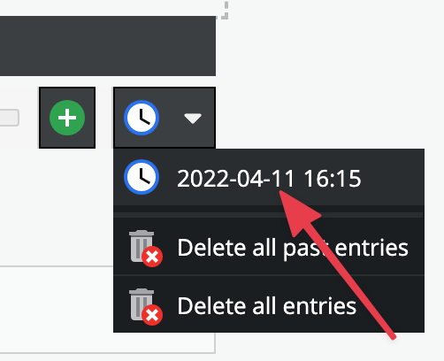
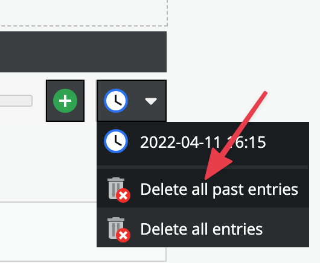

# Scheduled Block Editable

## General

The scheduled block element allows to manage scheduled content within an editable. 
Basically the scheduled block is very similar to the standard [block](./06_Block.md) editable.
You can configure one or multiple sub editables that are repeated multiple times as block items. 
The difference is, that within the scheduled block each block item has a specific timestamp and in 
the frontend only one block item - the one with the corresponding timestamp - is displayed at a time 
(not all within a loop).

In editmode, additional block items can be added and their timestamp can be configured. 

## Configuration

| Name        | Type      | Description                                                                                                                  |
|-------------|-----------|------------------------------------------------------------------------------------------------------------------------------|
| `class`     | string    | A CSS class that is added to the surrounding container of this element in editmode                                           |

## Methods

| Name            | Return    | Description                                                   |
|-----------------|-----------|---------------------------------------------------------------|
| `isEmpty()`     | bool      | Whether the editable is empty or not.                         |
| `getCount()`    | int       | Get the total amount of iterations.                           |
| `getCurrent()`  | int       | Get the current index while looping.                          |
| `getElements()` | array     | Return a array for every loop to access the defined children. |

## The Block Controls

| Control                                                           | Operation                                |
|-------------------------------------------------------------------|------------------------------------------|
|                 | Select a day for the block item timestamp.|
|                    | Select the time for the block item with the slider.|
|                           | Add new block item.                  |
|        | List of all block items with jump to function.                  |
|  | Delete all block items or all block items of the past.                  |


## Basic Usage

```twig

    <h2>{{ pimcore_input('blockinput') }}</h2>
    {{ pimcore_image('myimage') }}

```

The result in editmode should looks like to following: 


And in the frontend of the application:


In document preview, Pimore provides a time slider to get the preview for a certain time as soon as 
the document has at least one scheduled block editable. 

For details on how to create custom functionality using the time slider see 
[Preview Scheduled Content](../../19_Development_Tools_and_Details/39_Preview_Scheduled_Content.md).
