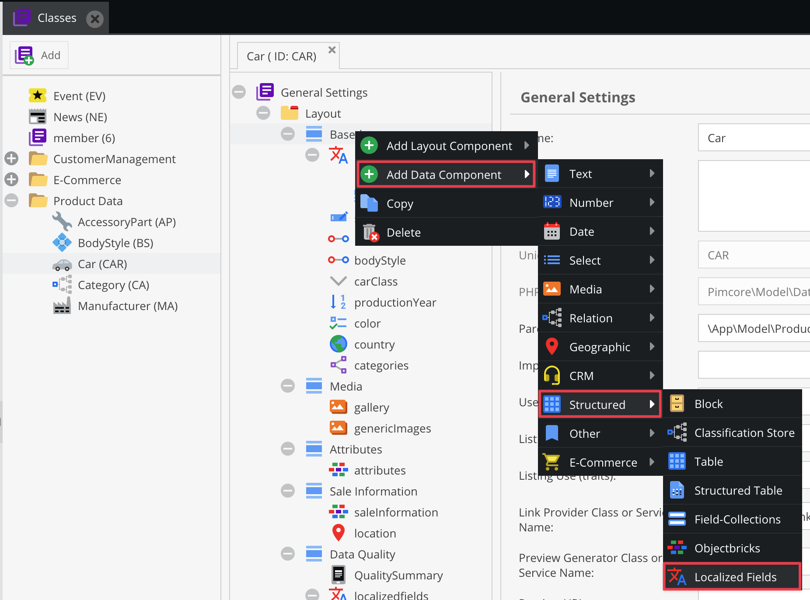
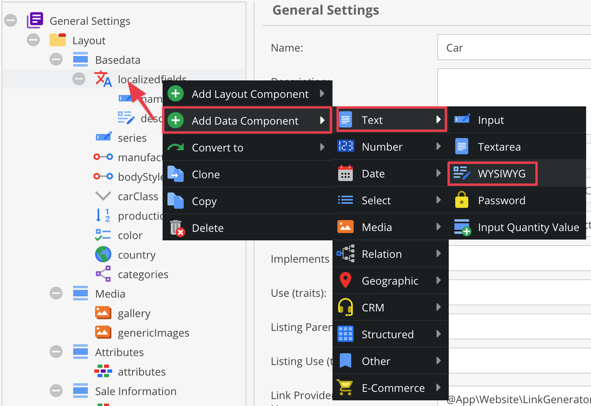
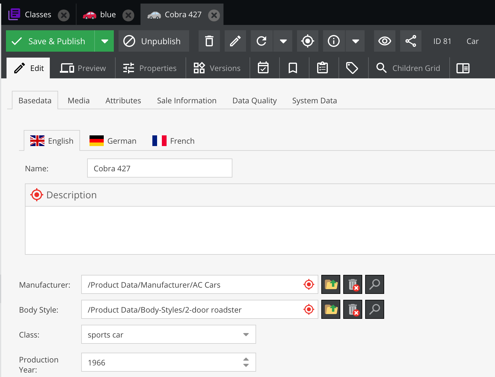
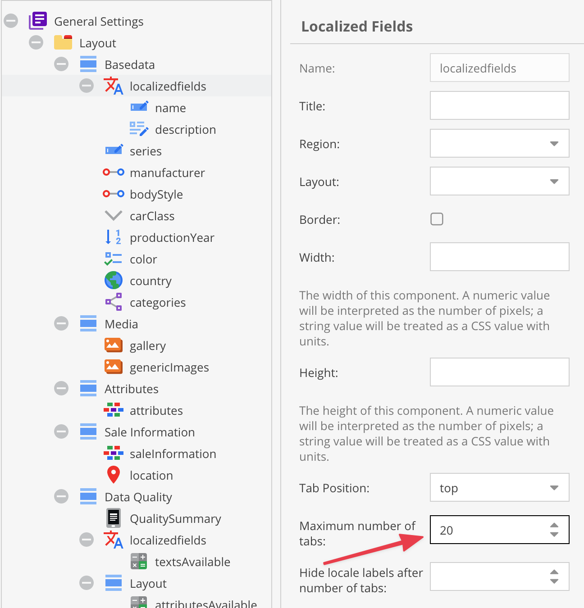
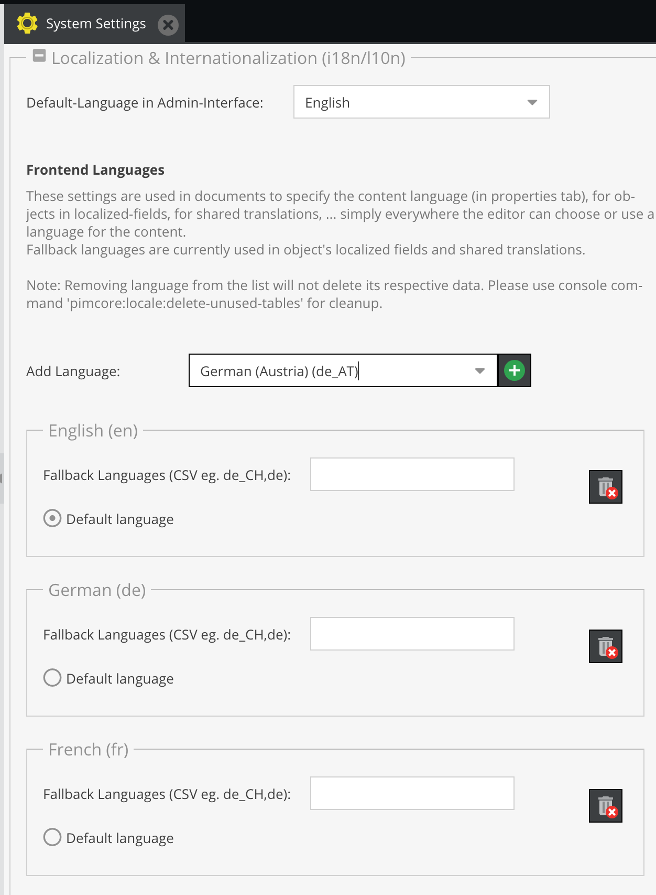

# Localized Fields

Localized fields allow the definition of attributes, that should be translated into multiple languages within an object. 
They can be filled with selected data types and layouts - due to technical and data storage reasons not all data types are
available. 

The advantage of this, is to make it very easy to translate fields to the configured languages.

## Definition of localized fields

First of all, you have to configure your localized fields and layouts within your class. This can be easily done in 
the class editor.



Then add attributes, that need to be translated, into this container. 



Pimcore generated the input widgets for every configured language. 
The result in your object editor will look like below:



By default, tabs are used if the number of languages does not exceed 15. 
This limit can be changed via the field settings in the class configurator.



## Definition of available Languages
If it's not already configured, please specify the valid languages for your website. 
You can do this in `Settings` -> `System Settings` -> `Localization & Internationalization`




## Working with PHP API

### Getting available languages ###

The following code will create an array containing the available languages for the front end (the user facing website). 

```php
		$config = \Pimcore\Config::getSystemConfig();
		$languages = explode(',', $config->general->validLanguages);
```

### Disable Fallback languages ###

You can disable the Fallbacklanguages

```php
    \Pimcore\Model\Object\Localizedfield::setGetFallbackValues(false);
```

Pimcore allows the back end (Pimcore administration user interface) to be translated. The back end and front end have different sets of languages and different translations.

When saving an object in Pimcore, the registry contains a reference to the locale of the admin interface. If you try to use  translation for another language you will get an error that the language is not found. If you want to translate something to one of the available languages for the front end you can create a new instance of the website translator with a locale from one of the valid languages. See the example below:

```php
//front end ($lang = string with language code)
$websiteTranslator = new \Pimcore\Translate\Website($locale);
$websiteTranslator->translate('name-of-translation-key');
```

### Accessing the data

Accessing the data is simple as below:

```php
// with global registered locale
$object = DataObject::getById(234);
$object->getInput1(); // will return the en_US data for the field "input1"
 
 
// get specific localized data, regardless which locale is globally registered
$object->getInput1("de") // will return the German value for the field "input1"
```

### Setting data

It works in the similar way as getting the data.

```php
$object = DataObject::getById(234);
$object->setInput1("My Name", "fr") // set the French value for the field "input1"
```

**Warning:** Please note that moving a field from outside (normal object field) into the localizedfield container means 
the loss of data from the field in all objects using this class.
