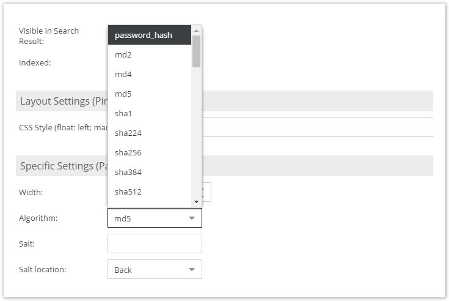

# Text Datatypes

## Input


The input field is a simple text input field. It's data is stored in a VARCHAR column in the database. The display 
width and database column length can be configured in the object class definition.


To set the value of an input field, the string value needs to be passed to the setter.

```php
$object->setInput("Some Text");
$object->save();
```


## Password


The password field is basically the same as the input field with hidden input characters. It's column length can not be 
changed, since passwords are always hashed using the selected algorithm.  

If a string appears to already be hashed, either by detection by [password_get_info()](https://www.php.net/manual/en/function.password-get-info.php) or if it matches any common hash patterns below, then it will not be hashed again.

 - Hexadecimal string
 - with legth of 32, 40, 48, 56, 64, 96, or 128 characters

These rules will detect the following hashes:
 - MD2, MD4, MD5, RIPEMD-128, Snefru 128, Tiger/128, HAVAL128
 - SHA-1, HAS-160, RIPEMD-160, Tiger/160, HAVAL160
 - Tiger/192, HAVAL192
 - SHA-224, HAVAL224
 - SHA-256, BLAKE-256, GOST, GOST CryptoPro, HAVAL256, RIPEMD-256, Snefru 256
 - SHA-384
 - SHA-512, BLAKE-512, SWIFFT


We recommend using `password_hash` as algorithm.
 




## Textarea


The textarea is an input widget for unformatted plain text. It is stored in a TEXT column in the database. Setting it's 
value works the same as for the input field. The width and height of the input widget can be configured in the object 
field definition.


## WYSIWYG

The WYSIWYG (What You See Is What You Get) input field is identical with the textarea field except for the fact that 
it's input widget allows formatting of text and can even hold images and links (references to assets and documents). 
If images and documents are used in a WYSIWYG widget, they create a dependency for the current object. To insert an 
image, assets can be dragged to a WYSIWYG widget. In order to create a link, a document needs to be dragged and dropped 
on selected text in the WYSIWYG widget. The text is stored as HTML. 


### Editor - Configuration
It's possible to pass a custom CKEditor config object to the wysiwyg editor. 

```
{
  toolbarGroups : [ { name: 'links' }],
  enterMode: CKEDITOR.CKEDITOR.ENTER_BR,
}
```

While most configuration parameters define which features shall be available when using the wysiwyg editor the `enterMode` defines the following behaviour:
* `CKEDITOR.CKEDITOR.ENTER_P` (default)
  * Pressing `enter` key adds a paragraph `<p></p>` tag at the cursor position
  * content gets always wrapped in `<p>` tags, even if you just enter one line
  * When setting the field's content via its setter method, the `<p>` tags do not get automatically added. When you later open the object in the admin panel and save the object, the `<p>` tags get added. This can be misleading because the content of the field changed although the field has not been touched.
* `CKEDITOR.CKEDITOR.ENTER_BR` 
  * Pressing `enter` key adds a `<br>` tag at the cursor position
* `CKEDITOR.CKEDITOR.ENTER_DIV`
  * same as `CKEDITOR.CKEDITOR.ENTER_P` but paragraphs get wrapped in `<div>` tags

More examples and config options for the toolbar and toolbarGroups can be found at 
[http://docs.ckeditor.com/#!/guide/dev_toolbar](http://docs.ckeditor.com/#!/guide/dev_toolbar). 

Please refer to the [CKeditor 4.0 Documentation](http://docs.ckeditor.com/).

  
### Global Configuration
You can add a Global Configuration for all WYSIWYG Editors for all objects by setting ```pimcore.object.tags.wysiwyg.defaultEditorConfig```

For this purpose, you can create a bundle and add the configuration in the new created file `/Resources/public/js/pimcore/startup.js` like this:

```
pimcore.object.tags.wysiwyg.defaultEditorConfig = {
    allowedContent: true
};
```

## Input Quantity Value

Quite similar to [Quantity Value](55_Number_Types.md) except that text values are allowed instead of the strict restriction to numeric values.


