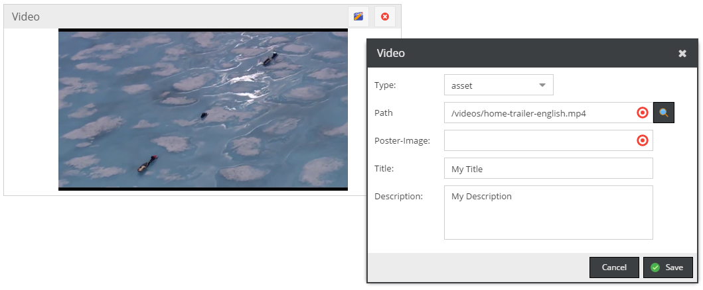

# Video Datatype



## Working with PHP API

```php
<?php
    $object = DataObject::getById(1234);
    print_r($object->getMyVideo());
?>
```

Will produce the following output depending on the content:
```php
# ASSET VIDEO
 
Pimcore\Model\DataObject\Data\Video Object
(
    [type] => asset
    [data] => Pimcore\Model\Asset\Video Object
        (
            [type] => video
            [id] => 27
            ...
        )
 
    [poster] => Pimcore\Model\Asset\Image Object
        (
            [type] => image
            [id] => 284
            ...
        )
 
    [title] => My Title
    [description] => My Description
)
 
# YouTube Video
Pimcore\Model\DataObject\Data\Video Object
(
    [type] => youtube
    [data] => pAE_ff8tV-g
    [poster] =>
    [title] => My Title
    [description] => My Description
)
 
# Vimeo Video
Pimcore\Model\DataObject\Data\Video Object
(
    [type] => vimeo
    [data] => 11696823
    [poster] =>
    [title] => My Title
    [description] => My Description
)
```


### Display Video using document's video tag

```php
<?php
 
 
$object = DataObject::getById(1234);
$v = $object->getMyVideo();
$videoData = $v->getData();
 
if($videoData) {
    $video = new \Pimcore\Model\Document\Editable\Video();
    $video->setOptions([
        "thumbnail" => "myVideoThumb", // specify your thumbnail here - IMPORTANT!
        "width" => "100%",
        "height" => 480,
        "attributes" => ["class" => "video-js custom-class", "preload" => "auto", "controls" => "", "data-custom-attr" => "my-test"]
    ]);
    $video->type = $v->getType();
    $video->id = ($videoData instanceof Asset) ? $videoData->getId() : $videoData;
    $video->title = $v->getTitle();
    $video->description = $v->getDescription();
    if($v->getPoster()) {
        $video->poster = $v->getPoster()->getId();
    }
    echo $video->frontend();
 
}
```


### Setting data to the video data type

```php
<?php
 
// asset video with poster image
 
$object = DataObject::getById(789);
$assetVideo = Asset::getById(123);
$assetImage = Asset::getById(456);
 
$videoData= new DataObject\Data\Video();
$videoData->setData($assetVideo);
$videoData->setType("asset");
$videoData->setPoster($assetImage);
$videoData->setTitle("My Title");
$videoData->setDescription("My Description");
 
$object->setMyVideo($videoData);
$object->save();
```
