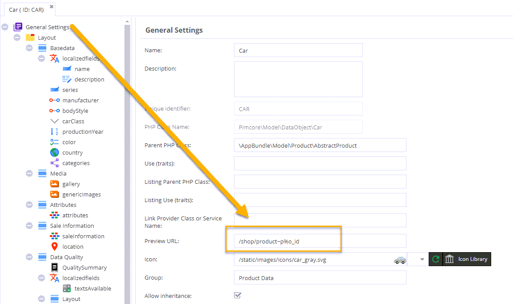
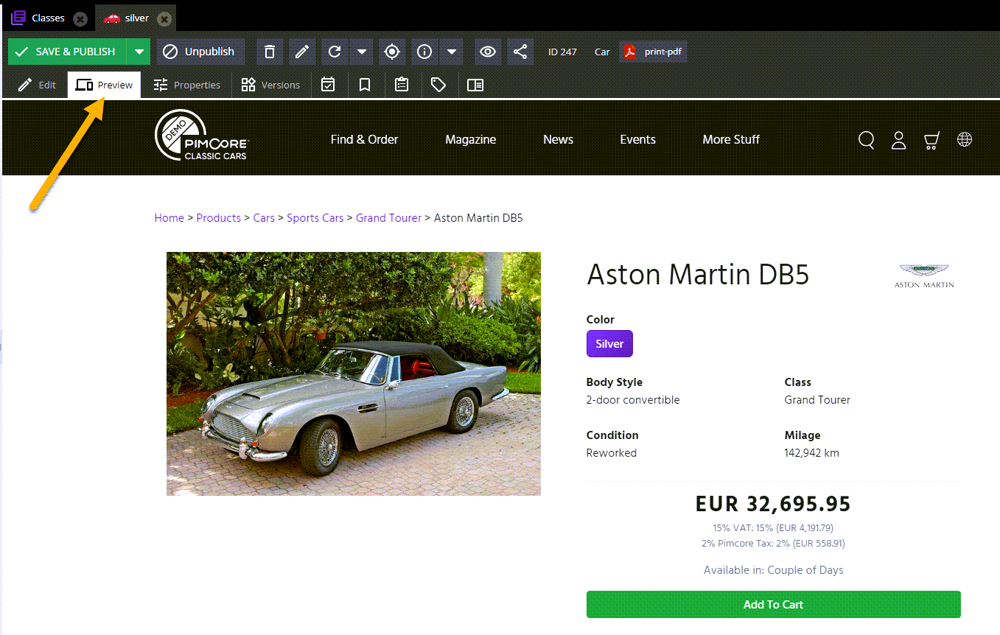

# Object Preview

> **DEPRECATED FEATURE**  
>
> **Please use [link generators](./15_Link_Generator.md) instead, which are more powerful and flexibel and 
offer the same functionality. The preview tab is automatically displayed when a link generator is defined 
on the data object class.**


The object preview allows you to configure a preview URL for your objects, you can do that in the basic configuration 
of your class (see screen below).

This URL can be a normal detail-page of your object, for example reachable via a 
[custom route](../../../02_MVC/04_Routing_and_URLs/02_Custom_Routes.md). 

You can define placeholders in your preview URL, for example the object ID or some custom properties of the class. 
You can use every property defined in the class even the properties which are added automatically by Pimcore, for 
example `o_id`, `o_key`, ...

Placeholders have the same syntax as you already know from the custom routes, just put a `%` in front of the property 
name. 

If you want to use the current user's language you can use `%_locale` as placeholder.

When opening the preview tab in an object, the placeholders are replaced with the current values of the object and the 
URL is opened in the tab. Only if you configure a preview URL in the class configuration, the preview tab is shown!

#### Example



The above configuration (`/shop/product~p%o_id`)  will result in the URL `/shop/product~p247` 
(or whatever the object id is).



You can get the editing data (not the saved one) by calling

```php
$object = Service::getElementFromSession('object', $objectId);
```  
