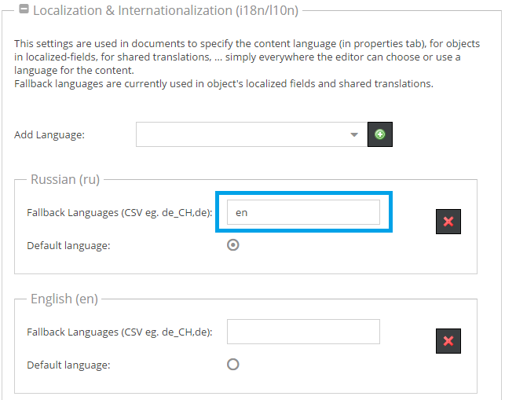

# Multi Language i18n & Localization in Pimcore

Localization is a very important aspect in every content management. In Pimcore localization can be centrally configured 
and has influence on multiple aspects within the system. 

Bottom line is that using Pimcore in a multi language mode is pretty easy for users and developers. Pimcore takes care 
of all technical aspects and by doing so follows the ZF patterns.

Pimcore has different sets of languages/locales and translations for the back end (CMS) and front end (website). 
This allows you to have the user interface of Pimcore in different languages than the website. You need to be aware of 
this when requesting the current and available locales, as they are different depending on the context. If a user is 
saving an object in Pimcore which is set to English, the current locale is different then when a visitor on your French 
website triggers a save action.
 
## Content Localization 

### Language Configuration
The available languages for content are configured centrally in system settings (*Settings* > *System Settings*
> *Localization & Internationalization (i18n/l10n)*). 

Following settings can be defined here: 
* Available languages
* System wide default language
* Fallback language for each language: if defined, Pimcore returns values from fallback language if primary language has 
 no values set. 

> *Note: Removing language from the Localization & Internationalization (i18n/l10n) list will not delete its respective data. Please use console command `pimcore:locale:delete-unused-tables` for cleanup.*
### Localized Content Areas
The activated languages have influence to following modules of content within Pimcore: 

* [Document - Localization (system property for language)](./02_Localize_your_Documents.md)
* [Shared Translations (Symfony Translations Component)](./04_Shared_Translations.md)
* [Localized Fields for Objects (object localization)](../05_Objects/01_Object_Classes/01_Data_Types/23_Localized_Fields.md)
* [Structured Data Fields - Classification Store](../05_Objects/01_Object_Classes/01_Data_Types/13_Classification_Store.md)

## Pimcore Backend UI Localization 

Pimcore backend UI localization is independent from content localization but works similar to Shared Translations. 
Basically every text in Pimcore backend is translatable, but there are two different sources for translations - Pimcore
system translations and project specific translations. 

### Pimcore System Translations
This covers all labels and texts within Pimcore that ship with Pimcore installation package. Here the standard language 
English is maintained by the core team. In addition to that, everybody can join the 
 [Pimcore translation project](https://poeditor.com/join/project/VWmZyvFVMH) to add system translations in additional
 languages. With every Pimcore release, newly added translations are added to the Pimcore installation package.

System translations can be overwritten by [Admin Translations](./07_Admin_Translations.md). 
