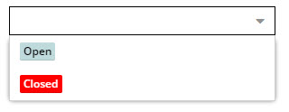

# Marking Stores

The Pimcore workflow engine provides several different ways how to store the acutal places of a subject. These are 
represented of the following marking store types.

## state_table (default)

This is the default marking store. The place information is stored in the element_workfow_state table. This would be 
the best option for Assets and Documents. For data objects the other marking store options might be the better choice as 
the data would be stored directly in the data object model as attributes.

##### configuration example
```yaml
   marking_store:
      type: state_table
```

## single_state

Stores the place in a attribute of the subject (calls the setter method). Can be used if a model cannot be in more then 
one state at the same time. This is the default single_state marking store provided by the Symfony framework. For data 
objects a select field (or maybe input field) would be the right Pimcore field to store the places when the single_state 
marking store is used.


##### configuration example
```yaml
   marking_store:
      type: multiple_state
      arguments:
         - workflowState
```

## multiple_state

Same as single_state but can be used if the subject can be in more then one state at the same time. Note: this cannot be 
used in combination with data object multiselect fields - use data_object_multiple_state instead.

##### configuration example
```yaml
   marking_store:
      type: multiple_state
      arguments:
         - workflowState
```

## data_object_multiple_state

Can be used to store mutliple places in a data object multiselect field.

##### configuration example
```yaml
   marking_store:
      type: data_object_multiple_state
      arguments:
         - workflowState
```


## data_object_splitted_state (data objects only)

Works similar to single_state and multiple_state but is able to store different places in different Pimcore data object 
attributes. Therefore it's needed to configure a mapping between places and data object attribute names.

##### configuration example

In the following example places which are related to the text of the data object are stored in the `workflowStateText` 
attribute whereas image related places are stored in `workflowStateImages`:

```yaml
   marking_store:
       type: data_object_splitted_state
       arguments:
           - text_open: workflowStateText
             text_finished: workflowStateText
             text_released: workflowStateText

             images_open: workflowStateImages
             images_finished: workflowStateImages
             images_released: workflowStateImages
```


## Options provider (for single_state, multiple_state and data_object_splitted_state)

If data object attributes (select or multiselect) are used to store the places a special options provider can be used 
to automatically provide the correct select options. Just setup `@pimcore.workflow.place-options-provider` as options 
provider and the workflow name as options provider data in the used data object attribute.


This options provider adds the places in a nicely formatted way:
