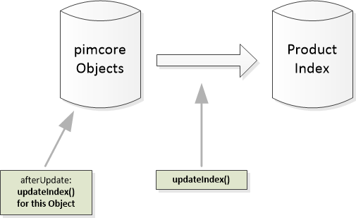

# Data Architecture and Indexing Process
Depending on the *Product Index* implementation, there are two different *Product Index* data architectures and ways for 
indexing: Simple Mysql Architecture and Optimized Architecture. 

For indexing itself the helper class `\Pimcore\Bundle\EcommerceFrameworkBundle\IndexService\Tool\IndexUpdater` 
or the provided Pimcore console commands can be used. 


## Simple Mysql Architecture
- Pimcore object data is transferred directly to the Product Index. 
- After every update of a Pimcore object, the changes are directly written into the Product Index. 
- Only used for `\Pimcore\Bundle\EcommerceFrameworkBundle\IndexService\Config\DefaultMysql`

> Updates of dependent objects (like child objects, variants that inherit data, related objects) are not transferred 
> into the index automatically. 




### Console Commands for Simple Mysql Architecture

- For manually updating the whole index use following command: 
```bash
php bin/console ecommerce:indexservice:bootstrap --update-index
```

- If you need to create or update the index structures you can use:
```bash
php bin/console ecommerce:indexservice:bootstrap --create-or-update-index-structure
```

- By default, Pimcore assumes that the product class is `Pimcore\Model\DataObject\Product`. If you have a 
different product class name, please use the `--object-list-class` param and provide the listing class name
that should be used. 

> For further details (e.g. only updating certain product types, apply list conditions) see `--help` section of the 
>`ecommerce:indexservice:bootstrap` command. 


## Optimized Architecture
- In the optimized architecture, object data is transferred **not** directly to the *Product Index*. 
- In this case a so called store table is between the Pimcore objects and the *Product Index*. This store table enables to ...
   - ... update the *Product Index* only if index relevant data has changed. Therefore the load on the index itself is reduced 
         and unnecessary write operations are prevented. 
   - ... update the *Product Index* asynchronously and therefore update also dependent elements (childs, variants, ...) 
         of an updated Pimcore object without impact on save performance. 
   - ... rebuilding the whole *Product Index* out of the store table much faster since no direct interaction with 
         Pimcore objects is needed. 

- After every update of a Pimcore object, the changes are written into the store table and all child objects of the 
updated object are added to the so called preparation queue (see later). As a consequence a periodic full update 
should not be necessary any more.
- Used for optimized mysql, elastic search, ...


### Console Commands for Optimized Architecture

For updating data in index following commands are available.
- For process the preparation queue and update Pimcore objects to the index store table, use following command. 
**This command should be executed periodically (e.g. all 10 minutes).**

```bash
php bin/console ecommerce:indexservice:process-queue preparation
```

- To update the Product Index based on changes stored in the store table use the following command. 
**This command should be executed periodically (e.g. all 10 minutes).**

```bash
php bin/console ecommerce:indexservice:process-queue update-index
```

- For manually update all Pimcore objects in the index store use following command. As stated before, this should only be
  necessary for an initial fill-up of the index. After that, at least Product Index Store and Pimcore objects should always 
  be in sync. It is important to execute `ecommerce:indexservice:process-queue preparation` and 
  `ecommerce:indexservice:process-queue update-index` periodically though.
```bash
php bin/console ecommerce:indexservice:bootstrap --update-index
```
> By default, Pimcore assumes that the product class is `Pimcore\Model\DataObject\Product`. If you have a 
> different product class name, please use the `--object-list-class` param and provide the listing class name
> that should be used. 

- Invalidate either the preparation queue or the index-update queue. This is usually **only needed during development** when 
  the store table is out of sync. Reset the preparation queue for instance when your product model 
  returns updated data for a field.
```bash
php bin/console ecommerce:indexservice:reset-queue preparation
php bin/console ecommerce:indexservice:reset-queue update-index
```

- If you need to create or update the index structures you can still use:
```bash
php bin/console ecommerce:indexservice:bootstrap --create-or-update-index-structure
```

> For further details see `--help` section of the commands. 


