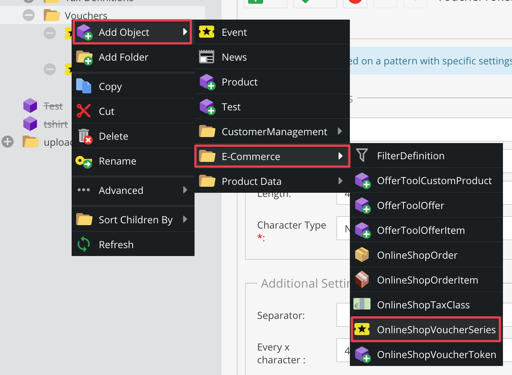
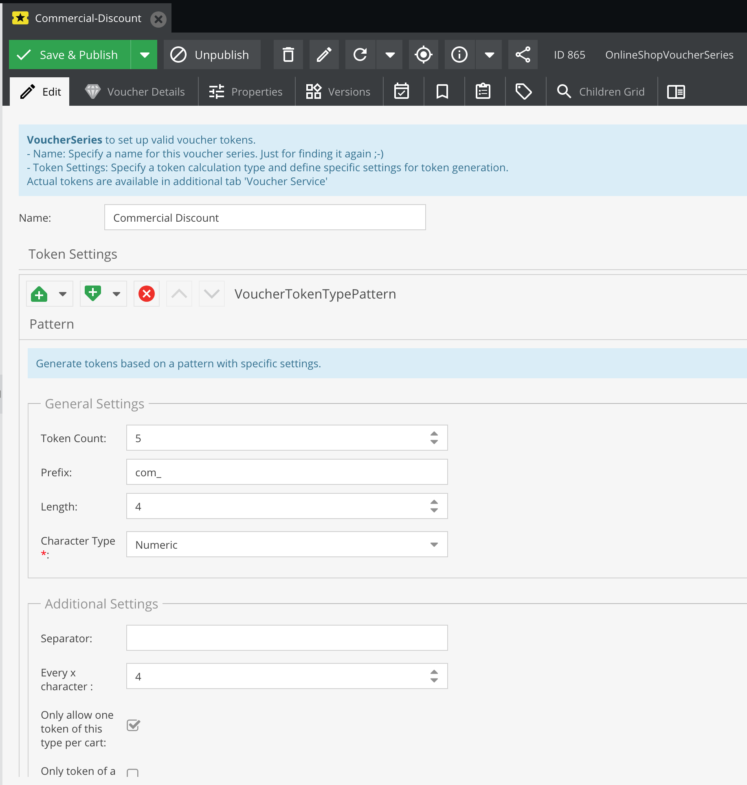
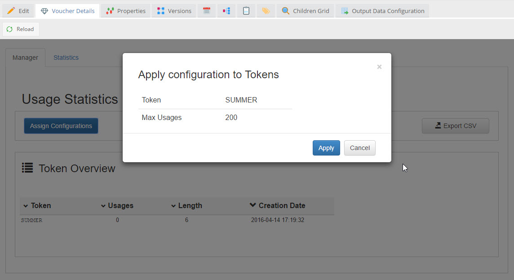
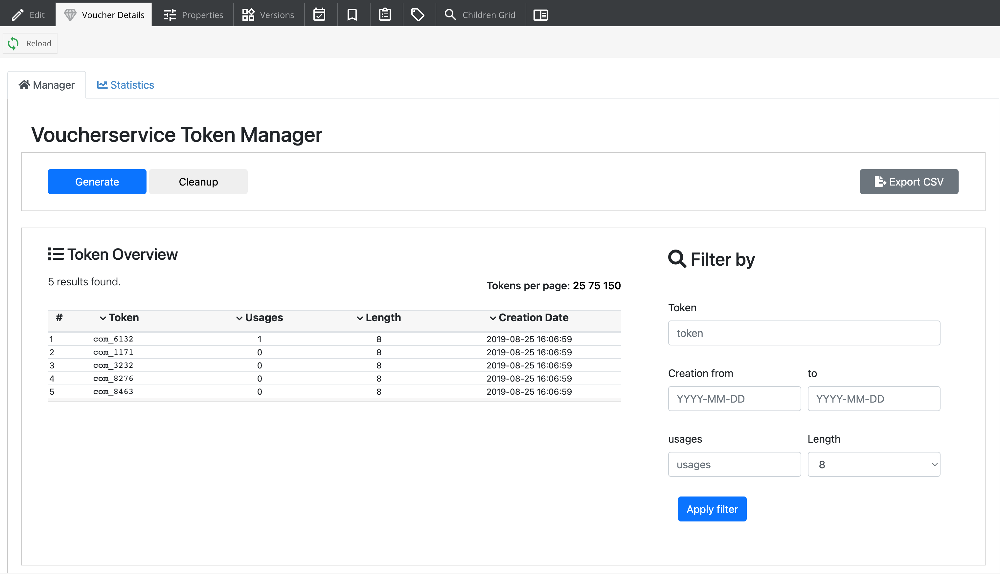
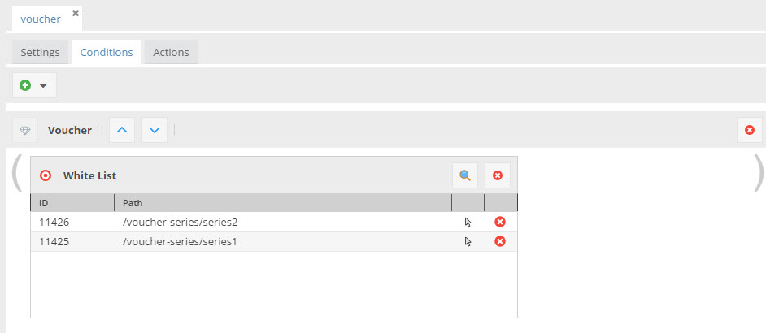

# Vouchers
Like Pricing Rules, also vouchers are supported out of the box by the framework.
To use vouchers, following steps are necessary:  
1) Create an `OnlineShopVoucherSeries` object.
2) Create tokens based on the `OnlineShopVoucherSeries`.
3) Create a Pricing Rule for the `OnlineShopVoucherSeries` and define the benefit of the voucher.
4) Allow the user to add a token to his cart. 
5) Display voucher information to user.


#### Create an `OnlineShopVoucherSeries` object
A voucher series contains basic information of the voucher and settings for creating the voucher tokens. It is 
represented by `OnlineShopVoucherSeries` objects. The corresponding class is added to the system during installation 
of the E-Commerce Framework. 

 
Currently there are two types of vouchers supported - Single and Pattern.
- Single: One single token is defined that can be used multiple times. 

- Pattern: Tokens are generated based on a certain pattern definition. 



#### Create tokens based on the `OnlineShopVoucherSeries`
In the Pimcore Backend UI, each `OnlineShopVoucherSeries` object has an additional tab for managing the voucher tokens. 
Depending on the token type there are different functions for managing the tokens and some statistics concerning the voucher. 
- Simple: 'Activate' the token and specify how often it may be used. 

- Pattern: Create tokens based on the defined pattern, export created tokens as csv and get an overview of created tokens 
and their usages. 



#### Create a Pricing Rule for the `OnlineShopVoucherSeries`
Once a voucher series is defined and tokens are created, a pricing rule has to define the benefits of the voucher. 
To do so, a special condition allows to specify the voucher series the pricing rule should be valid for. As action all 
available actions for pricing rules can be used.

The voucher token condition also can contain an error message, that can be shown if voucher token is added to cart, but
not all other conditions of the pricing rule are met.  




#### Allow the User to Add a Token to his Cart
A voucher token is always applied to a cart. To do so, use following snippet. 

```php
<?php

if($token = strip_tags($request->get('voucher-code'))) {
    try {
        $success = $cart->addVoucherToken($token);
        if($success) {
            $this->addFlash('success', $translator->trans('cart.voucher-code-added'));
        } else {
            $this->addFlash('danger', $translator->trans('cart.voucher-code-cound-not-be-added'));
        }
    } catch (VoucherServiceException $e) {
        $this->addFlash('danger', $translator->trans('cart.error-voucher-code-' . $e->getCode()));
    }
}
```

##### Error Codes of Exceptions thrown

| Code | Description |
| ---- | ------------------------------------------------------------------ |
| 1    | Token already in use. |
| 2    | Token already reserved. |
| 3    | Token reservation not possible. |
| 4    | No token for this code exists. |
| 5    | Criteria oncePerCart: Token of same series already in cart. |
| 6    | Criteria onlyTokenPerCart: Tokens in cart and tried to add token of type "only". |
| 7    | Criteria onlyTokenPerCart: Token of type "only" already in cart. |
| 8    | No more usages for a single token. |
| 8    | Token code not found in cart. |


#### Display Voucher Information
Since benefits for vouchers are defined via pricing rules, no special actions are needed to display them. They are just 
displayed the same way as all other Pricing Rules.

Another consequence of defining the benefits of vouchers via pricing rules is, that additional criteria (like date range etc.) 
can be defined to be required to get the benefits. To get all necessary detail information about vouchers, use 
`getPricingManagerTokenInformationDetails` of the cart or the voucher service. This method returns an array of `PricingManagerTokenInformation`
for each added token with following information: 
- Voucher Token
- Token Object
- List of applied pricing rules that require the given voucher token.
- List of not applied pricing rules that would take the given voucher token 
  into account but are not applied because some other conditions are not met.
- List of error messages that are defined in voucher token conditions of all 
  pricing rules that would take the given voucher token into account but are not
  applied because some other conditions are not met. 
- Flag that indicates if no pricing rules are defined for the given voucher token at all.    

See an sample snippet to display the voucher information to the customer:

```twig
<form method="post" action="{{ path('shop-cart-apply-voucher') }}" class="card p-2 mb-4">

    

        <ul class="list-group pb-3">

        

            <li class="list-group-item">
                <div class="row">
                    <div class="col-10" style="padding-top: 4px">
                        <div>{{ codeInfo.tokenCode }}</div>
                        
                            <small class="text-muted">{{ codeInfo.errorMessages | join(', ') }}</small>
                        
                        
                            <small class="text-muted">{{ 'cart.voucher-no-rule' | trans }}</small>
                        
                    </div>


                    <div class="col-2">
                        <a href="{{ path('shop-cart-remove-voucher', {'voucher-code': codeInfo.tokenCode}) }}" class="btn btn-outline-danger btn-sm">
                            <i class="fa fa-trash" aria-hidden="true"></i>
                        </a>

                    </div>
                </div>
            </li>
        

        </ul>

    


    <div class="input-group">
        <input name="voucher-code" type="text" class="form-control" placeholder="{{ 'cart.voucher-code' | trans }}">
        <div class="input-group-append">
            <button type="submit" class="btn btn-secondary">{{ 'cart.apply-voucher-code' | trans }}</button>
        </div>
    </div>
</form>
```
