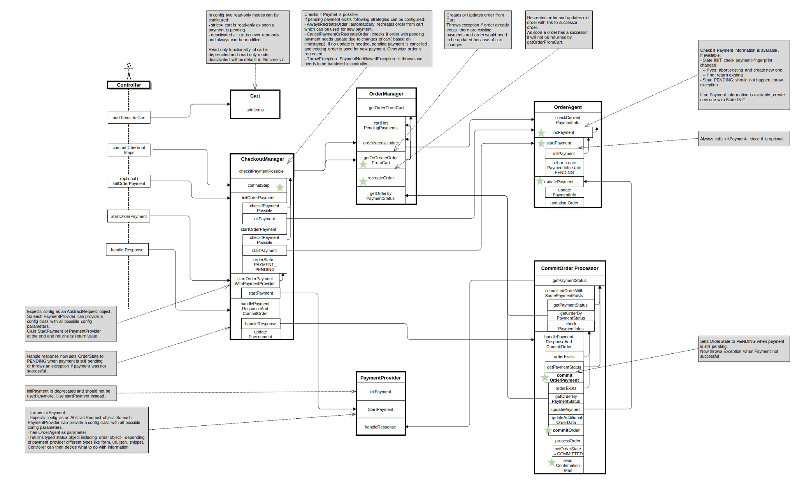

# Checkout Manager Details

Following documentation page provide a few more insights on Checkout Manager Architecture. 

## New aspects with V7 (Starting with Pimcore 6.1)

##### Basic goals of new architecture:
* Make payment integration easier and more transparent.
* Tackle the 'cart is readonly deadlock' problem.
* Introduce events for easier customization of the checkout process.

##### Changes in a nutshell: 
* Cart can be configured that it is not readonly any more as soon as an active payment exists. 
* Checkout manager can be configured with different strategies for handling active payments and restart of payments like
  * **RecreateOrder**: Create new order every time a payment is started and leave old orders untouched. 
  * **CancelPaymentOrRecreateOrder** (default value): Cancel payments if possible and cart has not changed, create new order when cart has changed.
  * **ThrowException**: Throw exceptions to make handling of these cases in controller possible.
* Payment provider have now typed responses (e.g. form, url, json, etc.) to make integration into controllers/templates more transparent


### Start with V7 architecture 
Following steps are necessary to get started with the V7 architecture. They will not be necessary
with Pimcore 10 since then new V7 architecture will be default. 

* Include `v7_configurations.yml` to your system configuration
```yml
imports:
    - { resource: '@PimcoreEcommerceFrameworkBundle/Resources/config/v7_configurations.yml' }
```

* Make sure your order manager services implement `Pimcore\Bundle\EcommerceFrameworkBundle\OrderManager\V7\OrderManagerInterface` 
  and `order_manager_id` is either set to your custom services or to `Pimcore\Bundle\EcommerceFrameworkBundle\OrderManager\V7\OrderManager` 
  as default service for all checkout tenants (see `v7_configurations.yml` as reference for default tenant). 

* Make sure your order agent classes extend from `Pimcore\Bundle\EcommerceFrameworkBundle\OrderManager\V7\OrderAgent` or
  the factory option `agent_class` is set to `Pimcore\Bundle\EcommerceFrameworkBundle\OrderManager\V7\OrderAgent` for all
  checkout tenants (see `v7_configurations.yml` as reference for default tenant). 
  
* Make sure your checkout managers implement `Pimcore\Bundle\EcommerceFrameworkBundle\CheckoutManager\V7` and factory option 
  `class` in checkout manager section is set to custom implementations or `Pimcore\Bundle\EcommerceFrameworkBundle\CheckoutManager\V7\CheckoutManager`
  for default service for all checkout tenants (see `v7_configurations.yml` as reference for default tenant).
  
* Make sure your custom commit order processors extend from `Pimcore\Bundle\EcommerceFrameworkBundle\CheckoutManager\V7\CommitOrderProcessor` or
  order processors are set to `Pimcore\Bundle\EcommerceFrameworkBundle\CheckoutManager\V7\CommitOrderProcessor` for all
  checkout tenants (see `v7_configurations.yml` as reference for default tenant).

* Set the cart factory option `cart_readonly_mode: deactivated` to make sure carts are not read only anymore once a payment is pending. 


### Architecture Details



* Stars mark places, where events are thrown. For details see [EventManager docs](../../20_Extending_Pimcore/11_Event_API_and_Event_Manager.md).

 