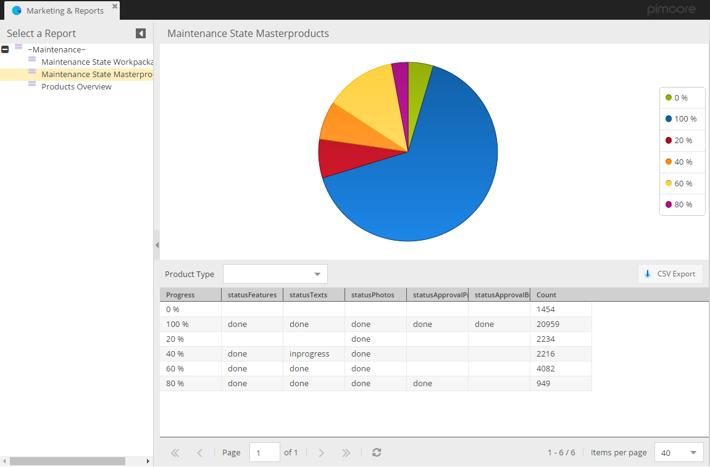

# Custom Reports

Custom Reports is a report engine directly integrated into Pimcore. With Custom Reports it is possible to create tabular
or chart reports (or both) with further filtering and export functionality. 



The data source for the reports is always a source adapter which is responsible for retrieving and preparing the report
data. Currently two adapters ship with Pimcore: 
- SQL: Retrieve Data based on a SQL statement

- Google Analytics: Retrieve Data from Google Analytics 


## Custom Data Source Adapters
It is easily possible to implement custom source adapters for special use cases. To do so following steps are necessary: 

- JavaScript Class: This class defines the user interface in the configuration of the custom report. It has to be located in 
the namespace `pimcore.report.custom.definition`, named like the adapter (e.g. `pimcore.report.custom.definition.mySource`)
 and implement the methods `initialize`, `getElement` and `getValues`. As sample see [analytics](https://github.com/pimcore/pimcore/blob/master/web/pimcore/static6/js/pimcore/report/custom/definitions/analytics.js)
- PHP Class: This class is the server side implementation of the adapter. It is responsible for retrieving and preparing 
the options, columns and data. It has to be located in the namespace `Pimcore\Model\Tool\CustomReport\Adapter`, named like
the adapter (e.g. `MySource`) and extend the abstract class `Pimcore\Model\Tool\CustomReport\Adapter\AbstractAdapter`. As sample see
 [analytics adapter](https://github.com/pimcore/pimcore/blob/master/pimcore/models/Tool/CustomReport/Adapter/Analytics.php). 

- PHP Class: This class is the server side implementation of the adapter. It is responsible for retrieving and preparing
the options, columns and data. It needs to implement the interface `Pimcore\Model\Tool\CustomReport\Adapter\CustomReportAdapterInterface`. As sample see
 [Sql](https://github.com/pimcore/pimcore/blob/master/pimcore/models/Tool/CustomReport/Adapter/Sql.php).
- Register your Adapter Factory as Service. If you are using a very simple Adapter Source, you can use the DefaultCustomReportAdapterFactory
  ```yml
  app.custom_report.adapter.factory.custom:
      class: Pimcore\Model\Tool\CustomReport\Adapter\DefaultCustomReportAdapterFactory
      arguments:
        - 'App\CustomReport\Adapter\Custom'
  ```
- If you are using a more complex Adapter, you can create your own Factory by implementing the interface `Pimcore\Model\Tool\CustomReport\Adapter\CustomReportAdapterFactoryInterface`
- Add your Adapter Factory to the configuration:

```yml
pimcore:
    custom_report:
        adapters:
            myAdapter: app.custom_report.adapter.factory.custom

````


