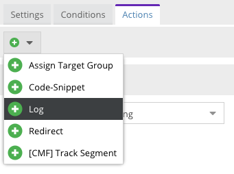

# Action Handlers

After a targeting rule matched it executes one or more actions as configured in the admin UI. These actions are actually
executed by action handlers, which are services implementing the [`ActionHandlerInterface`](https://github.com/pimcore/pimcore/blob/master/pimcore/lib/Pimcore/Targeting/ActionHandler/ActionHandlerInterface.php).

As with conditions, an action handler consists of 2 parts:

* A PHP class implementing the [`ActionHandlerInterface`](https://github.com/pimcore/pimcore/blob/master/pimcore/lib/Pimcore/Targeting/ActionHandler/ActionHandlerInterface.php).
  Have a look at [existing implementations](https://github.com/pimcore/pimcore/tree/master/pimcore/lib/Pimcore/Targeting/ActionHandler)
  to get an idea how to implement your own action handlers.
* A frontend JS class defining the admin UI for your action handler as shown on the actions tab of a targeting rule. You
  can have a look at [Pimcore's core actions](https://github.com/pimcore/pimcore/blob/master/web/bundles/pimcoreadmin/js/pimcore/settings/targeting/actions.js)
  for UI examples and at the [Customer Management Framework](https://github.com/pimcore/customer-data-framework/blob/master/src/Resources/public/js/pimcore/targeting/actions.js)
  as example for a third-party integration.


## Implementing an Action Handler

As example, we'll implement a simple `Log` action handler which will log each matched rule with a configured log level.
The action handler is a normal service which can depend on other services (as we do with the logger here).

<div class="alert alert-warning">
You can't rely on a visitor ID being set or a rule being passed. The visitor ID might be inexistent on the first 
request to the site and action handlers might be executed from outside the matching engine without passing a rule. Always
check those values before using them!
</div> 

```php
<?php

// src/AppBundle/Targeting/ActionHandler/Log.php

namespace AppBundle\Targeting\ActionHandler;

use Pimcore\Model\Tool\Targeting\Rule;
use Pimcore\Targeting\ActionHandler\ActionHandlerInterface;
use Pimcore\Targeting\Model\VisitorInfo;
use Psr\Log\LoggerInterface;

class Log implements ActionHandlerInterface
{
    /**
     * @var LoggerInterface
     */
    private $logger;

    public function __construct(LoggerInterface $logger)
    {
        $this->logger = $logger;
    }

    public function apply(VisitorInfo $visitorInfo, array $action, Rule $rule = null)
    {
        $level = $action['level'] ?? 'info';

        $this->logger->log(
            $level,
            'Matched target rule {ruleName} for visitor ID {visitorID} with config {config}',
            [
                'visitorID' => $visitorInfo->hasVisitorId() ? $visitorInfo->getVisitorId() : '(no visitor ID)',
                'ruleName'  => $rule ? $rule->getName() : '(no rule)',
                'config'    => json_encode($action)
            ]
        );
    }
}
```

Next, register your action handler as service. **Note:** we're using autowiring here to make sure the logger is automatically 
injected. If you don't use autowiring, enhance the service definition accordingly.

```yaml
services:
    _defaults:
        autowire: true
        autoconfigure: true
        public: false

    AppBundle\Targeting\ActionHandler\Log: ~
```

As last step, register the action handler to the targeting engine. Make sure the identifier is unique to your provider 
as you'll need to use it when implementing the admin UI JS part.

```yaml
pimcore:
    targeting:
        action_handlers:
            log: AppBundle\Targeting\ActionHandler\Log
```

### Postponed Actions

If your action handler needs to apply data in a later stage of the request/response cycle it can register an `action` on 
the `VisitorInfo` which can be consumed later. Currently only the `response` action scope is defined which is executed
in the `onKernelResponse` event, but more action scopes might be added in the future. 

Have a look at the [CodeSnippet](https://github.com/pimcore/pimcore/blob/master/pimcore/lib/Pimcore/Targeting/ActionHandler/CodeSnippet.php)
action handler as example. It registers an action via `$visitorInfo->addAction()` and implements the `ResponseTransformingActionHandlerInterface::transformResponse()`
which is called by the targeting engine for every action registered with the `response` scope.


## Admin UI

To make your action handler appear in the admin UI, you need to create and register a JS class defining the admin interface
for your action. Create a class extending `pimcore.settings.targeting.action.abstract` and register it to the system by
calling `pimcore.settings.targeting.actions.register()`. 

Have a look at [Pimcore's core actions](https://github.com/pimcore/pimcore/blob/master/web/bundles/pimcoreadmin/js/pimcore/settings/targeting/actions.js)
and the [Customer Management Framework](https://github.com/pimcore/customer-data-framework/blob/master/src/Resources/public/js/pimcore/targeting/actions.js)
for examples.

Start by adding a new JS file implementing the admin UI panel for your action:

```javascript
// src/AppBundle/Resources/public/js/targeting/actions.js

(function () {
    'use strict';

    pimcore.settings.targeting.actions.register(
        'log',
        Class.create(pimcore.settings.targeting.action.abstract, {
            getName: function () {
                return 'Log';
            },

            getPanel: function (panel, data) {
                var id = Ext.id();

                return new Ext.form.FormPanel({
                    id: id,
                    forceLayout: true,
                    style: 'margin: 10px 0 0 0',
                    bodyStyle: 'padding: 10px 30px 10px 30px; min-height:40px;',
                    tbar: pimcore.settings.targeting.actions.getTopBar(this, id, panel),
                    items: [
                        {
                            name: 'level',
                            fieldLabel: 'Level',
                            xtype: 'combo',
                            store: [
                                ['debug', 'Debug'],
                                ['info', 'Info'],
                                ['notice', 'Notice'],
                                ['warning', 'Warning'],
                                ['error', 'Error'],
                                ['critical', 'Critical'],
                                ['alert', 'Alert'],
                                ['emergency', 'Emergency']
                            ],
                            mode: 'local',
                            width: 300,
                            value: ('undefined' !== typeof data.level) ? data.level : 'info',
                            editable: false,
                            triggerAction: 'all'
                        },
                        {
                            xtype: 'hidden',
                            name: 'type',
                            value: 'log'
                        }
                    ]
                });
            }
        })
    );
}());
```

As soon as you [configured Pimcore to load the newly created file](../../20_Extending_Pimcore/13_Bundle_Developers_Guide/13_Loading_Admin_UI_Assets.md)
you should see your new action in the list of available actions:


