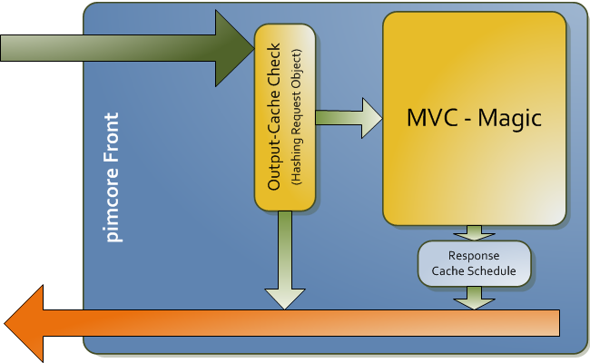
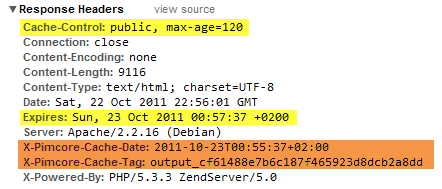

# Full Page Cache (Output Cache)

## Overview


## Configure the Full Page Cache

> **Please Note**  
> The full page cache is disabled by default if you're logged in in the admin interface or in the case 
> the debug mode (settings -> system -> debug) is on.

The full page cache only works with GET request, it takes the whole response (only for the frontend)
including the headers from a request and stores it into the cache. The next request to the same 
page (hostname and request-uri are used to build the checksum/hash identifier) will be served 
directly by the cache.

You can check if a request is served by the cache or not checking the response headers of the 
request. If there are X-Pimcore-Cache-??? (marked orange below) headers in the response they the 
page is coming directly from the cache, otherwise not.

If you have specified a lifetime, the response also contains the Cache-Control and the Expires 
header (perfect for HTTP accelerators like Varnish, ... ). 




You can find the settings for the full page cache in the system-settings (`Settings` -> `System`).


| Option | Description |
| ------ | ----------- |
| Enable | Tick to generally enable the full page cache. |
| Lifetime | You can optionally define a lifetime (in seconds) for the  full page cache. If you don't do, the cache is evicted automatically when there is a modification in the Pimcore Backend UI. If there is a lifetime the item stays in the cache even when it is changed until the TTL is over. The lifetime is useful if you have embedded some items which are not directly in the cms, like rss feeds, or twitter messages over the API. It is also highly recommended to specify a lifetime on high traffic websites so that the frontend (caches) isn't affected by changes in the admin-UI. Otherwise on every change in the admin-UI the whole output-cache is flushed, what can have drastic effects to the server environment. |
| Exclude Patterns | You can define some exclude patterns where the cache doesn't affect. The patterns have to be valid regular expressions (including delimiters). Type one pattern in each line. |
| Disable Cookie | You can define an additional cookie-name which disables the cache. The cookie "pimcore_admin_sid" (used for the Pimcore admin UI) ALWAYS disables the output-cache to make editor's life easier ;-) 


## Disable the Full Page Cache in your Code
Sometimes it is more useful to deactivate the full page cache directly in the code, for example when 
it's not possible to define an exclude-regex, or for similar reasons.

In this case you can use obtain the pull page cache service from the container and disable it, eg. in an action: 
```php
<?php
$this->get(\Pimcore\Bundle\CoreBundle\EventListener\Frontend\FullPageCacheListener::class)->disable("Your disable reason");
```

### Disable the Full Page Cache for a Single Request (only in DEBUG MODE)
Just add the parameter `?pimcore_outputfilters_disabled=true` to the URL.

### Disable the Full Page Cache with a Cookie and a Bookmarklet
Per default the disable-cookie in the system settings is set to `pimcore_admin_sid`. 

That means that if your're logged into Pimcore (have a session-id cookie) you will always get the 
content live and not from the cache. 

#### Bookmarklet
If you have the cookie `pimcore_admin_sid` in your system configuration you can use the following 
bookmarklet to disable the full page cache without having an active admin session in an other tab.
To use the bookmarklet, just drag the following links into your bookmark toolbar (any browser):

* <a href="javascript:(function()%7Bdocument.cookie%20%3D%20'pimcore_admin_sid%3Ddisablethecachebaby'%20%2B%20(Math.floor(Math.random()%20*%20147483648)%20%2B%202000)%20%2B%20'%3Bpath%3D%2F%3B'%7D)()">Disable Pimcore Cache</a>
* <a href="javascript:(function()%7Bvar%20a%2C%20b%2C%20c%2C%20e%2C%20f%3Bf%20%3D%200%3Ba%20%3D%20document.cookie.split(%22%3B%20%22)%3Bfor%20(e%20%3D%200%3B%20e%20%3C%20a.length%20%26%26%20a%5Be%5D%3B%20e%2B%2B)%20%7Bf%2B%2B%3Bfor%20(b%20%3D%20%22.%22%20%2B%20location.host%3B%20b%3B%20b%20%3D%20b.replace(%2F%5E(%3F%3A%255C.%7C%5B%5E%255C.%5D%2B)%2F%2C%20%22%22))%20%7Bfor%20(c%20%3D%20location.pathname%3B%20c%3B%20c%20%3D%20c.replace(%2F.%24%2F%2C%20%22%22))%20%7Bdocument.cookie%20%3D%20(a%5Be%5D%20%2B%20%22%3B%20domain%3D%22%20%2B%20b%20%2B%20%22%3B%20path%3D%22%20%2B%20c%20%2B%20%22%3B%20expires%3D%22%20%2B%20new%20Date((new%20Date()).getTime()%20-%201e11).toGMTString())%3B%7D%7D%7Dalert(%22Expired%20%22%20%2B%20f%20%2B%20%22%20cookies%22)%7D)()">Enable Pimcore Cache</a>
