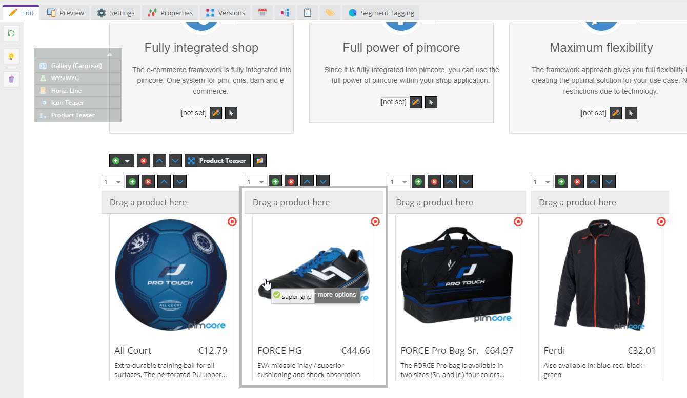

# Integrating Commerce Data with Content

Content commerce, shop everywhere, vanish separation of content and commerce - these are key phrases that popup with 
every state-of-the-art e-commerce project. With its integrated approach Pimcore does exactly that and provides several
tools to provide the best experience for the users.

One of these tools are [Renderlets](../03_Documents/01_Editables/28_Renderlet.md),
which provide a great way to integrate dynamic object (thus commerce) content to Pimcore documents. 




Follow the steps to create a Product teaser similar to the one in our [advanced demo](https://demo-advanced.pimcore.org/en).

### Create Area Brick `MyProductTeaser` with Renderlet 

**MyProductTeaser Implementation** 
```php
<?php
namespace AppBundle\Document\Areabrick;

class MyProductTeaser extends AbstractAreabrick
{
    /**
     * {@inheritdoc}
     */
    public function getName()
    {
        return 'My Product Teaser';
    }
}

```

**MyProductTeaser Template**
```php 
<?php
/**
 * @var \Pimcore\Templating\PhpEngine $this
 * @var \Pimcore\Templating\PhpEngine $view
 * @var \Pimcore\Templating\GlobalVariables $app
 */
?>
<div class="row">
    <?php while($this->block("teaserblock")->loop()) { ?>

        <?php echo $this->renderlet("productteaser", array(
            "controller" => "shop",
            "action" => "product-cell",
            "editmode" => $this->editmode, // needed if editmode should be delivered to controller of renderlet
            "title" => "Drag a product here",
            "height" => 370,
            "width" => 270
        )); ?>

    <?php } ?>
</div>
```


### Create Controller and Action for Teaser Content

**Controller Action** 
```php 
    public function productCellAction(Request $request)
    {
    
        $id = $request->get("id");
        $type = $request->get("type");

        if($type == 'object') {

            $product = Product::getById($id);
            $this->view->product = $product;

        } else {
            throw new \Exception("Invalid Type");
        }
        
    }
```

**Template** 
```php 
<?php
/**
 * @var \Pimcore\Templating\PhpEngine $this
 * @var \Pimcore\Templating\PhpEngine $view
 * @var \Pimcore\Templating\GlobalVariables $app
 * @var $product \AppBundle\Model\DefaultProduct
 */

$product = $this->product;

$linkProduct = $product->getLinkProduct();
$link = $linkProduct->getDetailUrl();

$language = $this->language;

$col = $this->getParam("editmode") ? 12 : 3;


?>

<div class="col-sm-<?= $col ?> col-lg-<?= $col ?> col-md-<?= $col ?>">
    <div class="thumbnail product-list-item">
        <a href="<?= $link ?>">
            <?=$product->getFirstImage('productList')->getHtml(['class' => 'product-image'])?>

            <div class="caption">
                <h4 class="pull-right"><?=$product->getOsPrice()?></h4>

                <h4>
                    <?= $product->getOSName() ?>
                </h4>

                <p><?=\AppBundle\Tool\Text::cutStringRespectingWhitespace(trim(strip_tags($product->getDescription())), 70)?></p>

            </div>
        </a>

        <div class="buttons">
            <div class="row">
                <div class="col-md-6">
                </div>
                <div class="col-md-6">
                    <a href="<?= $this->pimcoreUrl(
                        [
                            "language" => $language,
                            "action" => "add",
                            "item" => $product->getId()
                        ], "cart") ?>" class="btn btn-success btn-product">
                        <span class="glyphicon glyphicon-shopping-cart"></span>
                        <?= $this->translate("shop.buy") ?>
                    </a>
                </div>
            </div>
        </div>
    </div>
</div>
```
