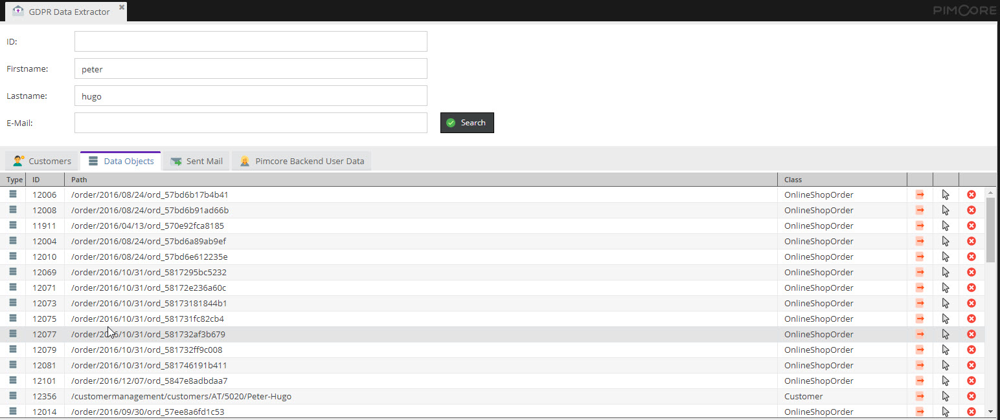

# Data Protection and GDPR

Pimcore provides several tools and settings to provide GDPR compliance and support implementation providers and users 
with corresponding tasks. 


> Please note: Since Pimcore is a framework, therefore the final responsibility for GDPR compliance is always with the 
> solution provider, implementation partner and owner of an actual solution.  

## Restriction of Access

Restriction of data access is achieved with Pimcores extensive permission system. It allows to restrict accessing, 
changing and deleting information on user and role level. For details see 
[User and Roles documentation](../../Development_Documentation/22_Administration_of_Pimcore/07_Users_and_Roles.md). 

The Permission Analyser allows to analyse the actual permissions of a Pimcore user for a certain element. 
  


## Right of Access by the data subject

For searching and exporting person related data, Pimcore provides the GDPR Data Extractor. 


It allows ...
* ... to search for person related data based on search terms for `ID`, `Firstname`, `Lastname` and `E-Mail`.
* ... to list all found data from different data sources and open details for the found data directly from the result list. 
* ... to export all data of a found item as json. 
* ... delete the data directly from the result list if possible.   

The search is a word based search. This means only complete words are found, no parts of words. For example if you search
for `Chris`, records with `Christian` will NOT be found. All search terms (`ID`, `Firstname`, `Lastname` and `E-Mail`) 
are connected with AND, so they all need to occur for a data record to be shown in the result list.

To use the full potential of the GDPR search the simpleBackendSearchBundle has to be installed!
If that`s not the case you only can use the very limited version of the GDPR search.

Supported data sources by Pimcore core are: 
* Data Objects
* Sent Mails
* Pimcore Backend User Data

This list always can be extended. For more information concerning configuration and extension see your 
[GDPR Data Extractor Development Docs](../../Development_Documentation/18_Tools_and_Features/35_GDPR_Data_Extractor.md). 


## Right to Rectification

Pimcore follows the principle of single source publishing. Therefore information should be stored only once in the system
and linked to all places where it is needed. As a result, rectification of data is made easy since it only needs to be 
done in one place. Once updated and published, the information is delegated to all places where it is used and Pimcore 
takes care of the rest.  

 
## Right to Erasure

Also in terms of erasure of information, Pimcores single source publishing comes in handy. Once a data element (e.g. data
object) is deleted, Pimcore automatically cleans up all related data (e.g. versions, etc.) and updates the places where  
it used. 

For email logs cleanup use Pimcore Console command `pimcore:email:cleanup` with required option `older-than-days` to delete the logs older than x days
```bash
./bin/console pimcore:email:cleanup --older-than-days=12
```

> Of course Pimcore cannot cleanup external data copies or backups. This has to be taken care of by the owner of the actual solution. 


## Deactivation of Usage Log
Pimcore logs information about every action that is done in Pimcore backend for audit trail and traceability reasons. The 
logged information concludes timestamp, user id, called action and can be used to reproduce things if something 
goes wrong.

This feature can be deactivated in system settings. See [Logging Docs](../../Development_Documentation/19_Development_Tools_and_Details/07_Logging.md) 
in the Development Documentation for more details. 
 
> It is not recommended to turn off this feature. 
 
## Deactivation of Versions
For every save action of data elements (documents, assets, data objects) Pimcore writes a version for traceability, audit 
trail and the possibility to go back to older versions. The version information concludes timestamp, user and the actual 
data. 

This feature can be deactivated in system settings. See [Versioning Docs](../../Development_Documentation/18_Tools_and_Features/01_Versioning.md) 
in the Development Documentation for more details. 
 
> It is not recommended to turn off this feature. 


## Data Type to store Consent
Pimcore provides a special data type for its data objects to store consents given by a user. 
See [Consent](../../Development_Documentation/05_Objects/01_Object_Classes/01_Data_Types/20_Consent.md) for details. 
